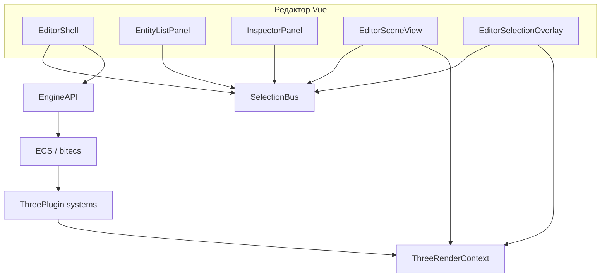

# Архитектура Helios

Документ описывает **цели проекта**, **стек**, **границы пакетов** и **типичный поток данных** между редактором, ядром ECS и рендером Three.js. При изменении поведения или публичного API соответствующие разделы нужно обновлять (см. [maintaining-documentation.md](maintaining-documentation.md)).

## Цели и ограничения

- **ECS в браузере:** мир на **bitecs**, системы и компоненты конфигурируются при создании движка.
- **Редактор как библиотека:** `@merlinn/helios-editor` монтируется в DOM приложения (`createEditor`), не навязывает сборщик игры — только peer-зависимости.
- **Рендер через плагин:** `@merlinn/helios-three-plugin` предоставляет capability `renderer.three` и контекст `ThreeRenderContext`; игровая сцена и «редакторские» объекты разведены по корням сцены (см. ниже).

Опционально в монорепозитории: **`helios-physics-plugin`**, **`helios-cli`** — подключаются только там, где они реально используются.

## Технологический стек

| Слой | Технология |
|------|------------|
| Язык | TypeScript (строгая типизация в пакетах) |
| Монорепозиторий | pnpm workspaces (`packages/*`, `examples/*`) |
| ECS | bitecs |
| Рендер | three.js (через плагин) |
| UI редактора | Vue 3 |
| Сборка core | tsup → `dist/` |
| Сборка редактора | Vite library mode → `dist/` + типы |

## Карта пакетов

| Пакет | Назначение |
|-------|------------|
| `@merlinn/helios-core` | `Engine`, регистрация компонентов/систем, **`EngineAPI`** для инструментов и редактора, типы буфера обмена редактора, спавн/слияние сущностей из карт компонентов |
| `@merlinn/helios-three-plugin` | Регистрация **`ThreePlugin`**, **`ThreeRenderContext`**, связь ECS ↔ `THREE.Object3D`, ресурсные билдеры мешей, системы камеры/света/сцены, хелпер для выделения в редакторе |
| `@merlinn/helios-editor` | **`createEditor`**, Vue-оболочка (`EditorShell`), список сущностей, инспектор, сценовый вид с камерой, оверлей выделения, контекстные меню, мост буфера ↔ API |
| `examples/astris` | Пример игры на Vite: подключение движка, плагинов и редактора |

## Ядро (`helios-core`)

- **Жизненный цикл:** создание `Engine` с конфигурацией → `init()` → игровой цикл / системы; публичные операции уровня редактора идут через **`EngineAPI`** (сущности, компоненты, сериализация для буфера и т.д.).
- **Расширение:** новые компоненты и системы регистрируются в конфигурации движка; публичные контракты, которые видит редактор, должны оставаться стабильными или сопровождаться обновлением документации и потребителей.
- **Сущности из данных:** спавн из карты компонентов и слияние карты на существующую сущность — точки входа для вставки из буфера и пресетов.
- **Буфер редактора:** формат **`EditorEntityClipboardV1`** и операции уровня API (копирование/вставка сущности или компонента, слияние на выбранную сущность) живут в core, чтобы UI не дублировал правила данных.

## Плагин Three.js (`helios-three-plugin`)

- **Capability:** строковый ключ **`renderer.three`**; доступ к контексту типа **`ThreeRenderContext`** после инициализации движка с плагином.
- **Два корня сцены:** игровой контент под **`worldRoot`**; объекты только для редактора (например оверлей выделения) — под **`editorRoot`**, чтобы отделить от загрузки/сериализации игровой сцены.
- **Системы (обзор):** синхронизация мешей и объектов Three с ECS, камера, свет, сцена, отрисовка; дескрипторы геометрии/материалов и билдеры ресурсов — см. исходники в `systems/` и `builders/`.
- **Редактор:** вспомогательные функции вроде **`tryGetEntityThreeObject`** связывают выделенную сущность с объектом в сцене для подсветки и манипуляций.

## Редактор (`helios-editor`)

### Точки входа

- **`createEditor({ api, root, … })`** создаёт **`Editor`** (Vue-приложение в `root`), **`EditorSceneView`** (канвас сцены + управление камерой после привязки движка), **`EditorSelectionOverlay`** (оверлей выделения в 3D).
- После **`engine.init()`** нужно вызвать **`attachEngine(engine)`** (или передать `engine` в опциях, если он уже инициализирован), чтобы сценовый вид и оверлей получили контекст Three.

### Состояние выделения

- **`SelectionBus`** — общая шина: список сущностей, инспектор и оверлей подписаны на одни и те же события выделения.

### Основные модули (ориентиры по путям)

| Область | Путь / файлы |
|---------|----------------|
| Оболочка и панели | `inspector/EditorShell.vue`, `EntityListPanel.vue`, `InspectorPanel.vue` |
| Сценовый вид и выделение | `view/EditorSceneView.ts`, `view/EditorSelectionOverlay.ts` |
| Выделение | `selection/SelectionBus.ts` |
| Плагины редактора (ядро UI) | `inspector/InspectorEditorPlugin.ts`, `createDefaultEditorPlugins.ts` |
| Буфер ↔ API | `inspector/editorEntityClipboardBridge.ts` |
| Контекстные меню | `ui/contextMenu/` (`useContextMenu.ts`, `ContextMenu.vue`, `clampContextMenuToViewport.ts`) |
| Пресеты примитивов | `presets/defaultEditorPrimitiveComponents.ts` |

### Контекстные меню и вставка

- Меню строятся через **`useContextMenu`** и общий **`ContextMenu.vue`**; позиция ограничивается видимой областью окна.
- Вставка **сущности** из буфера создаёт новую сущность; вставка в инспекторе на выбранную сущность выполняет **слияние** компонентов через API ядра (не дублировать эту логику во Vue).

## Пример `astris`

- Скрипт **`dev`** собирает **`@merlinn/helios-editor`** и запускает Vite — приложение импортирует **собранный** редактор из `dist/`.
- Служит эталоном подключения: зависимости workspace, инициализация движка, регистрация плагинов, монтирование `createEditor`.

## Поток данных (схема)

## Связанные документы

- [overview.md](overview.md) — краткий обзор монорепозитория.
- [maintaining-documentation.md](maintaining-documentation.md) — как держать эту документацию актуальной.
- [README.md](../README.md) — установка и запуск примера.
