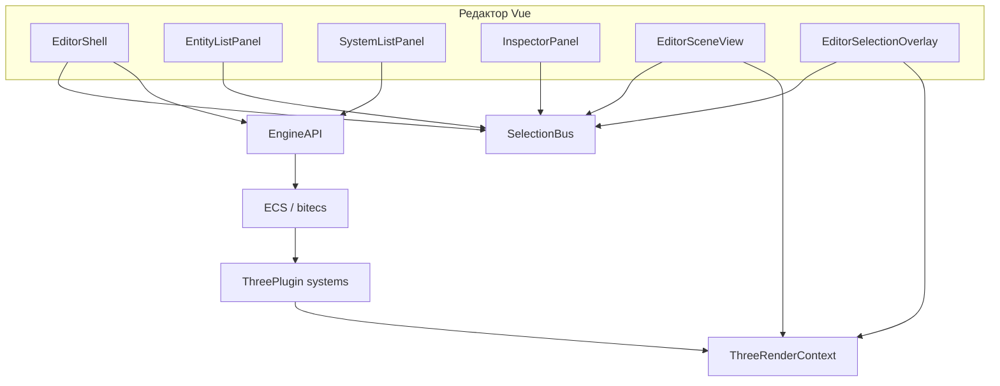

# Архитектура Helios

Документ описывает **цели проекта**, **стек**, **границы пакетов** и **типичный поток данных** между редактором, ядром ECS и рендером Three.js. При изменении поведения или публичного API соответствующие разделы нужно обновлять (см. [maintaining-documentation.md](maintaining-documentation.md)).

## Цели и ограничения

- **ECS в браузере:** мир на **bitecs**, системы и компоненты конфигурируются при создании движка.
- **Редактор как библиотека:** `@merlinn/helios-editor` монтируется в DOM приложения (`createEditor`), не навязывает сборщик игры — только peer-зависимости.
- **Рендер через плагин:** `@merlinn/helios-three-plugin` предоставляет capability `renderer.three` и контекст `ThreeRenderContext`; игровая сцена и «редакторские» объекты разведены по корням сцены (см. ниже).

Опционально в монорепозитории: **`helios-physics-plugin`**, **`helios-cli`** — подключаются только там, где они реально используются.

## Технологический стек

| Слой | Технология |
|------|------------|
| Язык | TypeScript (строгая типизация в пакетах) |
| Монорепозиторий | pnpm workspaces (`packages/*`, `examples/*`) |
| ECS | bitecs |
| Рендер | three.js (через плагин) |
| UI редактора | Vue 3 |
| Сборка core | tsup → `dist/` |
| Сборка редактора | Vite library mode → `dist/` + типы |

## Карта пакетов

| Пакет | Назначение |
|-------|------------|
| `@merlinn/helios-core` | `Engine`, регистрация компонентов/систем, **`EngineAPI`** для инструментов и редактора, типы буфера обмена редактора, спавн/слияние сущностей из карт компонентов |
| `@merlinn/helios-three-plugin` | Регистрация **`ThreePlugin`**, **`ThreeRenderContext`**, связь ECS ↔ `THREE.Object3D`, ресурсные билдеры мешей, системы камеры/света/сцены, хелпер для выделения в редакторе |
| `@merlinn/helios-input-plugin` | **`ViewportInputPlugin`**, ECS singleton **`ViewportInput`**, capability metadata **`game.viewportInput`**; только ввод, без игровой логики камеры |
| `@merlinn/helios-editor` | **`createEditor`**, Vue-оболочка (`EditorShell`), список сущностей, инспектор, сценовый вид с камерой, оверлей выделения, контекстные меню, мост буфера ↔ API |
| `examples/astris` | Пример игры на Vite: подключение движка, плагинов и редактора |

## Ядро (`helios-core`)

- **Жизненный цикл:** создание `Engine` с конфигурацией → `init()` → игровой цикл / системы; публичные операции уровня редактора идут через **`EngineAPI`** (сущности, компоненты, сериализация для буфера и т.д.).
- **Расширение:** новые компоненты и системы регистрируются в конфигурации движка; публичные контракты, которые видит редактор, должны оставаться стабильными или сопровождаться обновлением документации и потребителей.
- **Сущности из данных:** спавн из карты компонентов и слияние карты на существующую сущность — точки входа для вставки из буфера и пресетов.
- **Импорт 3D-моделей:** ассет **`ModelManifest`** (`loadModel`) + бинарный GLB (`loadGltfBinary`); маркер **`ModelInstance`** в сцене раскрывается в дерево сущностей (`spawnModelInstance` / `expandAllModelInstances`). Импорт на границе пайплайна (CLI, drag-and-drop) — см. **[model-import.md](model-import.md)**.
- **Имя сущности:** компонент **`Name`** с полем **`label`** (строка) — для списка сущностей в редакторе и сцен; в сцене JSON обычные строки в `label` не считаются GUID ассетов, если путь не зарегистрирован в `AssetManager`.
- **Буфер редактора:** формат **`EditorEntityClipboardV1`** и операции уровня API (копирование/вставка сущности или компонента, слияние на выбранную сущность) живут в core, чтобы UI не дублировал правила данных.
- **Системы и Play в редакторе:** у **`System`** статическое **`runsInEditor`** (по умолчанию `false`). Хост с capability **`EDITOR_PLAY_SESSION_CAPABILITY`** при `attachEngine` вызывает **`EngineAPI.applyEditorSystemHostPolicy()`** — симуляционные системы **disabled**, без `start`/`update`. Слой редактора (`runsInEditor === true`) стартует с **`engine.start()`**. Enter Play: **`beginPlaySessionSystems()`** (enable + start симуляции, restart editor-систем после снимка); **`createEditor`** переключает shell и game viewport на вкладку **Игра** (`viewportInteraction.setMode("game")`). Exit Play: **`endPlaySessionSystems()`** (stop + disable симуляции, restart editor-систем). Пауза game window через **`EngineAPI.setSimulationPaused()`** временно пропускает `update` у simulation systems без `stop`/`disable`; `runsInEditor` systems продолжают input/render/camera. Снимок UI — **`SystemRuntimeSnapshot`** / **`listSystemRuntimeSnapshots()`**, `updateActive` отражает pause.

## Плагин Three.js (`helios-three-plugin`)

- **Capability:** строковый ключ **`renderer.three`**; доступ к контексту типа **`ThreeRenderContext`** после инициализации движка с плагином.
- **Два корня сцены:** игровой контент под **`worldRoot`**; объекты только для редактора (например оверлей выделения) — под **`editorRoot`**, чтобы отделить от загрузки/сериализации игровой сцены.
- **Рендер в core (сериализуемо):** **`Geometry`**, **`Material`**, тег **`Mesh`**, **`Camera`** (`fov`, `near`, `far` без `aspect`), **`AmbientLight`**, **`DirectionalLight`**. Дескрипторы и парсеры — **`packages/helios-core/src/rendering/`**; хелпер **`meshEntityComponents()`** для спавна мешей. Подробности JSON — [scene-serialization.md](scene-serialization.md).
- **Рантайм Three (не в JSON):** **`ThreeObject`**, **`ThreeMesh`** (resource ids), **`MeshResourcesResolved`**. **`EnsureThreeRenderableSystem`** добавляет runtime-компоненты для сущностей с core-маркерами и трансформами.
- **Камера ECS:** движок **не** создаёт камеру по умолчанию. Сущность с **`Camera`** из сцены/префаба/spawn; **`UpdateThreeCameraSystem`** синхронизирует `THREE.PerspectiveCamera` (aspect из canvas).
- **Свет ECS:** **`AmbientLight`** / **`DirectionalLight`** в данных сцены; **`targetEntity`**: sentinel **`DIRECTIONAL_LIGHT_NO_TARGET_ENTITY`** (или `0` в JSON) — `light.target` на корень мира; иначе цель на сущность **`targetEntity`**.
- **Системы (порядок):** **`EnsureThreeRenderable`** → **`ThreeResourceBuild`** / билдеры → **`UpdateThreeMesh`** / камера / свет / **`UpdateThreeObject`** → сцена / render.
- **GLTF-ассеты:** `registerThreeAssetLoaders` — **`loadGltfBinary`** (кэш `GLTF`), **`loadGltfMesh`** / **`loadGltfMaterial`** (срезы по индексам); manifest-сущности ссылаются на sub-GUID через **`Geometry.guid`** / **`Material.guid`**.
- **Текстуры:** **`loadTexture`** (PNG/JPG по пути из `.meta`); слоты в **`Material.descriptor`** (`map`, `normalMap`, …) — см. **[textures.md](textures.md)**.
- **Редактор:** вспомогательные функции вроде **`tryGetEntityThreeObject`** связывают выделенную сущность с объектом в сцене для подсветки и манипуляций; для **ray pick** на мешах/светах/камерах на корневой `Object3D` пишется **`userData.heliosEntityEid`** ([`tagThreeObjectForPicking`](../packages/helios-three-plugin/src/picking/tagThreeObjectForPicking.ts)).

## Редактор (`helios-editor`)

### Точки входа

- **`createEditor({ api, root, … })`** создаёт **`Editor`** (Vue-приложение в `root`), **`EditorSceneView`** (канвас сцены + управление камерой после привязки движка), **`EditorSelectionOverlay`** (оверлей выделения в 3D).
- После **`engine.init()`** нужно вызвать **`attachEngine(engine)`** (или передать `engine` в опциях, если он уже инициализирован), чтобы сценовый вид и оверлей получили контекст Three.

### Состояние выделения

- **`SelectionBus`** — общая шина: список сущностей, инспектор, оверлей и **ray pick во вьюпорте** подписаны на одни и те же события выделения.
- **Левая колонка:** вкладки **Entities** / **Systems** / **Assets**; список сущностей — **дерево иерархии** (как в Unity): `Parent.target` задаёт родителя, expand/collapse, drag-and-drop вызывает **`EngineAPI.setEntityParent`**. Список систем опрашивает **`EngineAPI.listSystemRuntimeSnapshots()`** (индикаторы enabled, started, runsInEditor, updateActive). **Assets** — модели (`listModelAssetGuids`) и текстуры (`listTextureAssetGuids`); drag-and-drop `.glb`/`.obj` или `.png`/`.jpg` на вьюпорт (FBX → CLI).

### Управление вьюпортом (Unity-like)

- **ЛКМ** без Alt — луч в `worldRoot`, выбор сущности через **`SelectionBus`** ([`pickEntityAtCanvasPoint`](../packages/helios-editor/src/view/picking/pickEntityAtCanvasPoint.ts)); клик по пустоте снимает выделение.
- **Alt+ЛКМ** и **СКМ (MMB)** — вращение камеры (`OrbitControls`); **ПКМ** — режим полёта (как раньше). `OrbitControls` не использует ПКМ, чтобы не конфликтовать с fly.
- Политику жестов можно подменить через **`SceneNavigationPolicy`** ([`SceneNavigationPolicy.ts`](../packages/helios-editor/src/view/picking/SceneNavigationPolicy.ts)) — задел под Hand tool (Q) и т.п.
- **Вкладка «Игра»:** отдельный canvas и режим ввода; `EDITOR_SHELL_ACTIVE_VIEW_CAPABILITY` переключает game/editor render pass. ЛКМ в игре — опциональный **`GAME_VIEWPORT_POINTER_SINK_CAPABILITY`**; DOM-ввод game canvas пишет **`helios-input-plugin`** (DOM → **`ViewportInput`** singleton / **`game.viewportInput`**), а игровая камера реализуется системой игры (в Astris — **`AstrisFlyCameraSystem`** → `Position`/`Rotation`). Редакторский fly/orbit остаётся в **`EditorSceneView`**. Детали и backlog — [editor-game-viewport-future.md](editor-game-viewport-future.md).

### Game UI overlay (`GameUiPlugin`)

- Отдельно от **`EditorPlugin`** (панели редактора): **`GameUiPlugin`** монтирует DOM/HUD над **`#helios-game-view`** в `.shell__gameUiRoot` ([`EditorShell.vue`](../packages/helios-editor/src/inspector/EditorShell.vue)).
- **`createEditor({ gameUiPlugins: [...] })`** создаёт **`GameUiHost`**, который при mount shell вызывает `setup` каждого плагина с **`GameUiContext`**: `api`, `root`, `getActiveView` / `subscribeActiveView` (синхронно с вкладкой и `EDITOR_SHELL_ACTIVE_VIEW_CAPABILITY`), **`playMode`** (`PlayModeController`).
- Контейнер оверлея: `pointer-events: none`; интерактивные виджеты помечают `data-game-ui-interactive` → `pointer-events: auto`.
- Первый потребитель: Astris **game cockpit** — [`AstrisGameHudPlugin`](../examples/astris/src/gameUi/AstrisGameHudPlugin.ts): верхняя панель статуса (gen/cells), dock (Play/Stop, Pause, Paint/Erase, Clear, пресеты), collapsible подсказки; стили в `astrisGameUi.css`.
- Capabilities Astris: `astris.golTool` (paint/erase), `astris.golStats` (поколение + alive), `astris.gridClickQueue`; pointer sink поддерживает LMB drag (`tryHandlePointerMove`).

## Плагин ввода (`helios-input-plugin`)

- **`ViewportInputPlugin`** (`requires` **`renderer.three`**): слушатели на **game canvas**, регистрирует ECS singleton **`ViewportInput`** и capability metadata **`game.viewportInput`** (`inputEntity`).
- **Гейт:** если зарегистрирован **`EDITOR_SHELL_ACTIVE_VIEW_CAPABILITY`**, ввод активен только при **`activeView === "game"`**; без shell capability — всегда активен (standalone).
- **Контракт:** `ViewportInput.keys` / `buttons` — bitmask, `lookDeltaX/Y` — frame deltas; игровые системы сами решают, как использовать ввод.
- **`Rotation`** (core): ориентация как **кватернион** `{ x, y, z, w }`; **`UpdateThreeObjectSystem`** синхронизирует в `object.quaternion`. Старый JSON с тремя полями euler (XYZ) конвертируется при спавне. Инспектор показывает **Euler XYZ** и пишет обратно в quat.

### Иерархия сущностей (`Parent`)

- Компонент **`Parent`**: `target` — eid родителя; **`UpdateThreeObjectSystem`** вешает `THREE.Object3D` на родительский object (с **`isCyclic`**).
- **Scene JSON:** у сущности можно указать `"id": "cube-1"` и `"Parent": { "target": "scene-root" }` (строка = scene id) или числовой eid. [`SceneManager`](packages/helios-core/src/engine/SceneManager.ts) спавнит в два прохода через [`spawnSceneEntityInstances`](packages/helios-core/src/engine/spawnEntitiesWithParent.ts).
- **Play snapshot:** при capture сохраняется **`sourceEid`**; при **`applySceneSnapshot`** `Parent.target` переназначается на новые eid; затем **`expandAllModelInstances`** раскрывает маркеры **`ModelInstance`** (после Play в снимке обычно уже развёрнутые меши).
- **API:** **`EngineAPI.setEntityParent(child, parent | null)`**, **`getEntityParentEid`**; утилиты дерева — [`entityHierarchy.ts`](packages/helios-core/src/utils/entityHierarchy.ts).

### Выделение объекта во вьюпорте

- **Сейчас:** [`EditorSelectionOverlay`](../packages/helios-editor/src/view/EditorSelectionOverlay.ts) — контуры рёбер (`EdgesGeometry`, `LineSegments`) по каждому `THREE.Mesh`; если мешей нет — запасной **`BoxHelper`**.
- **Запланировано:** подключить post-processing в цепочке рендера редактора — **`EffectComposer`** + **`OutlinePass`** (`three/addons` / `examples/jsm/postprocessing`), чтобы получить классический экранный outline без опоры только на геометрию рёбер; потребуется согласовать размер/мигание канваса, порядок проходов и выбор объектов для маски OutlinePass с тем же выделением по ECS.

### Основные модули (ориентиры по путям)

| Область | Путь / файлы |
|---------|----------------|
| Оболочка и панели | `inspector/EditorShell.vue`, `EntityListPanel.vue`, `EntityHierarchyNode.vue`, `SystemListPanel.vue`, `InspectorPanel.vue` |
| Сценовый вид, пикинг, выделение | `view/EditorSceneView.ts`, `view/picking/`, `view/EditorSelectionOverlay.ts` |
| Выделение | `selection/SelectionBus.ts` |
| Плагины редактора (ядро UI) | `inspector/InspectorEditorPlugin.ts`, `createDefaultEditorPlugins.ts` |
| Game UI (HUD над game canvas) | `gameUi/GameUiHost.ts`, `gameUi/GameUiPlugin.ts` |
| Буфер ↔ API | `inspector/editorEntityClipboardBridge.ts` |
| Контекстные меню | `ui/contextMenu/` (`useContextMenu.ts`, `ContextMenu.vue`, `clampContextMenuToViewport.ts`) |
| Пресеты примитивов | `presets/defaultEditorPrimitiveComponents.ts` |

### Контекстные меню и вставка

- Меню строятся через **`useContextMenu`** и общий **`ContextMenu.vue`**; позиция ограничивается видимой областью окна.
- Вставка **сущности** из буфера создаёт новую сущность; вставка в инспекторе на выбранную сущность выполняет **слияние** компонентов через API ядра (не дублировать эту логику во Vue).

## Пример `astris`

- Скрипт **`dev`** собирает **`@merlinn/helios-editor`** и запускает Vite — приложение импортирует **собранный** редактор из `dist/`.
- Служит эталоном подключения: зависимости workspace, инициализация движка, регистрация плагинов, монтирование `createEditor({ gameUiPlugins: [new AstrisGameHudPlugin()] })`.
- **Game of Life:** `GameOfLifeViewportPlugin` регистрирует очередь кликов, `astris.golTool` / `astris.golStats` / `astris.golHover` / `astris.golArmedPreset`; `AstrisGridPointerSink` — клик toggle, drag paint/erase, armed preset по ЛКМ в ячейке под курсором; hover без кнопок через опциональный `IGameViewportPointerSink.tryHandlePointerHover` / `tryHandlePointerLeave` (слушатели на game canvas в `EditorSceneView`). Превью при наведении — `GolHoverSyncSystem` (`InstancedMesh`, до 128 клеток); живые клетки — `LifeCellInstancedRenderSystem` (один `InstancedMesh` на всё поле, без ECS `Mesh` на клетку); занятость — `astris.golCellIndex` (O(1)). GLTF: `loadGltfMesh` запекает `mesh.matrix` в геометрию, `gltf.scene` скрыт от рендера. Пресеты — `golPresets.ts` (`GOL_BASIC_PRESET_IDS` слева, `GOL_ADVANCED_PRESET_IDS` справа: пушки, пульсар, метузелы); HUD **вооружает** паттерн (`astris.golArmedPreset`), установка по клику; SVG-превью и тултипы — `GolPatternPreviewSvg`, `AstrisBrushTooltip`, `golPresetTooltips.ts`. `GameOfLifeStepSystem`, группа `LifeCells` в сцене; cockpit — `examples/astris/src/gameUi/`.

## Поток данных (схема)

## Связанные документы

- [overview.md](overview.md) — краткий обзор монорепозитория.
- [maintaining-documentation.md](maintaining-documentation.md) — как держать эту документацию актуальной.
- [README.md](../README.md) — установка и запуск примера.
