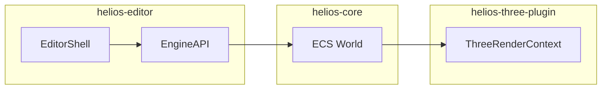

# Helios — обзор

Лёгкий **ECS-движок для веб** с монорепозиторием на **pnpm**. Подробности устройства — в **[architecture.md](architecture.md)**; как не допускать расхождений кода и документов — в **[maintaining-documentation.md](maintaining-documentation.md)**.

## Пакеты (кратко)

### `@merlinn/helios-core`

Ядро: `Engine`, мир **bitecs**, **`EngineAPI`**, спавн и слияние сущностей из карт компонентов, типы буфера редактора **`EditorEntityClipboardV1`**.

### `@merlinn/helios-three-plugin`

Интеграция **Three.js**: capability **`renderer.three`**, **`ThreeRenderContext`**, **`worldRoot`** и **`editorRoot`**, системы мешей/камеры/света и ресурсные билдеры.

### `@merlinn/helios-editor`

Редактор на **Vue 3**: **`createEditor`**, **`SelectionBus`**, панели сущностей и инспектора, **`EditorSceneView`**, оверлей выделения, контекстные меню в **`ui/contextMenu/`**.

Требуются peer-зависимости: **`vue`**, **`@merlinn/helios-core`**, **`@merlinn/helios-three-plugin`**, **`three`** (см. `packages/helios-editor/package.json`).

### Пример `examples/astris`

Демонстрация подключения движка и редактора; `dev` собирает редактор и запускает Vite.

## Поток данных (упрощённо)

## Разработка

- `pnpm run typecheck` — проверка типов во всех workspace со скриптом `typecheck`.
- `pnpm run build` — рекурсивная сборка пакетов.

Индекс всей документации: **[docs/README.md](README.md)**. Инструкции для ИИ-агентов: **[AGENTS.md](../AGENTS.md)**.
